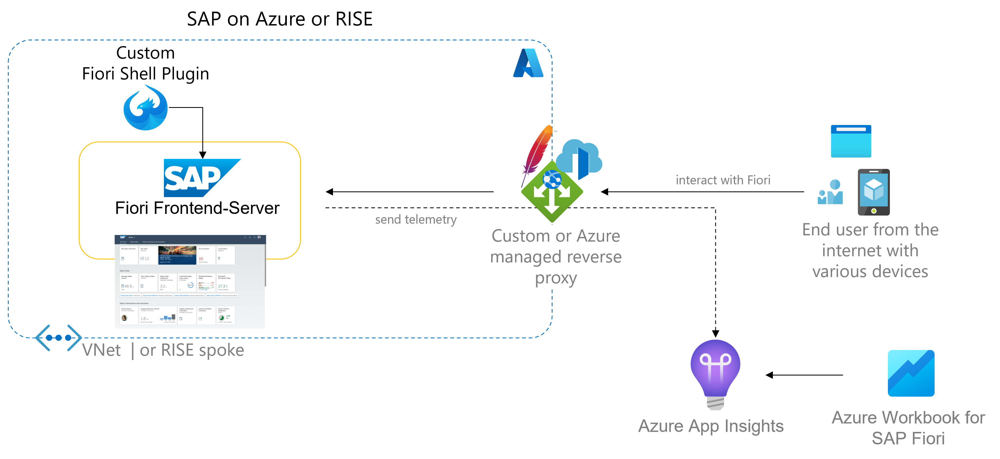

# Azure App Insights SAP-Fiori plugin Quickstart (PREVIEW)

This repos describes how to utilize a [SAP Fiori Launchpad Plugin](https://assets.cdn.sap.com/sapcom/docs/2019/03/b2dff710-427d-0010-87a3-c30de2ffd8ff.pdf) to gain **client-side insights** into Fiori metrics with [Azure Application Insights](https://learn.microsoft.com/azure/azure-monitor/app/app-insights-overview?tabs=net). It leverages the standard views for Azure Application Insights and a dedicated Azure Monitor Workbook for SAP.

> **Note**
> Find official API documentation for the Azure Application Insights JS snippet [here](https://github.com/microsoft/ApplicationInsights-JS#snippet-setup-ignore-if-using-npm-setup).

A typical single instance setup would look like below. The plugin concept applies to native SAP on Azure deployments, SAP RISE, on-premises and [SAP BTP Build WorkZone, Standard edition](https://help.sap.com/docs/Launchpad_Service/8c8e1958338140699bd4811b37b82ece/9db48fa44f7e4c62a01bc74c82e74e07.html).

> **Note**
> Connection from BTP to the SAP workload on Azure can be done with the cloud-native [SAP Private Link Service for Azure](https://blogs.sap.com/2021/12/29/getting-started-with-btp-private-link-service-for-azure/) or the [SAP Cloud Connector](https://help.sap.com/docs/CP_CONNECTIVITY/cca91383641e40ffbe03bdc78f00f681/e6c7616abb5710148cfcf3e75d96d596.html) (SCC). For any-premises choose Azure VNet integration via [ExpressRoute](https://learn.microsoft.com/azure/expressroute/expressroute-introduction)/VPN or the SCC.



> **Note** - The reverse proxy is required in case of strict [CORS policies](https://github.com/microsoft/ApplicationInsights-SAP-Fiori-Plugin#how-to-deal-with-cross-origin-resource-sharing-cors-errors). Proxy choices range from managed services like [Azure Front Door](https://learn.microsoft.com/azure/frontdoor/front-door-overview) or [Azure Application Gateway](https://learn.microsoft.com/azure/application-gateway/overview) to self-hosted solutions like Apache.

🧪Tested with Business Suite NW 7.51 and S/4HANA 2022 using Edge Browser.

## Prerequisites

1. Azure Application Insights instance (access to [connection string](https://learn.microsoft.com/azure/azure-monitor/app/sdk-connection-string?tabs=net#find-your-connection-string))
2. Imported [Azure Monitor Workbook](Fiori-Performance-Analysis.workbook) (Create new, open code view <kbd></></kbd>, select Gallery template, copy & paste the json into it and save)
3. Fiori Launchpad with SAPUI5 1.86+ (older Fiori stacks need to consider [alternatives](#sapui5-feature-dependencies)).

> **Note** - you may upgrade your UI5 stack independently from the NetWeaver release

4. Fiori Launchpad configured to use custom Plug-Ins. See [SAP's Fiori docs](https://www.sap.com/documents/2019/03/b2dff710-427d-0010-87a3-c30de2ffd8ff.html) (especially steps 76 onwards) to get started.

| Parameter   | Value       | Description |
| ----------- | ----------- | ----------- |
| Launchpad Plugin ID      | `ZAZUREFLPPLUGIN`       | Retrieve from builder.customTasks.configuration.app.name in [ui5-deploy.yaml](ui5-deploy.yaml)       |
| Launchpad Plugin URL   | `/sap/bc/ui5_ui5/sap/`        | Re-use from here or collect from `npm run deploy` output        |
| UI5 Component ID   | `microsoft.com.flpmonitor`        | Verify from `sap.app.id` in [manifest.json](/webapp/manifest.json)        |

> **Note**
> Optionally add Azure Monitor for SAP Solutions Instance for infrastructure telemetery correlation

### SAPUI5 feature dependencies

Default settings of this repos anticipate UI5 releases 1.86+. Use below table to understand potential feature scope for older releases.

| Feature   | SAPUI5 release       | Usage |
| ----------- | ----------- | ----------- |
| [AppLifeCycle](https://sapui5.hana.ondemand.com/sdk/#/api/sap.ushell.services.AppLifeCycle)  | 1.38+ | Use SAP's public API to handle app loaded events |
| [Interaction](https://sapui5.hana.ondemand.com/sdk/#/api/module:sap/ui/performance/trace/Interaction)  | 1.76+ | Use SAP public tracing APIs for analysis, matching SAP backend trace measurments |
| [User Info](https://sapui5.hana.ondemand.com/sdk/#/api/sap.ushell.services.UserInfo%23methods/Summary)  | 1.86+ | Use SAP's public Fiori user API to correlate user info |
| [Passport](https://help.sap.com/docs/ABAP_PLATFORM_NEW/468a97775123488ab3345a0c48cadd8f/a075ed88ef324261bca41813a6ac4a1c.html)  | n.a. | Use SAP's internal API to enrich requests with RootId and TransactionId for deep linking from Azure into SAP backend transactions |

If none are applicable revert to tracking Fiori hash changes only:

```javascript
//uncomment in init function
$(window).hashchange(function () {
    window.appInsights.trackPageView();
}
```

Another alternative poses the App Insights configuration `enableAutoRouteTracking`. However, launchpad navigation durations are not reflected, because it gets treated as a large single-page-application (SPA).

## Local build instructions (SAP Business Application Studio)

```cmd
git clone https://github.com/MartinPankraz/az-monitor-sap-fiori-plugin.git
```

This app has been generated using the SAP Fiori tools - App Generator in [SAP Business Application Studio](https://help.sap.com/docs/SAP%20Business%20Application%20Studio), as part of the SAP Fiori tools suite.  In order to launch the generated app, simply run the following commands from the generated app root folder:

```cmd
npm install
```

Maintain your [Azure Application Insights Connection String](https://learn.microsoft.com/azure/azure-monitor/app/sdk-connection-string?tabs=net#find-your-connection-string) and [AICloudRole](https://github.com/MartinPankraz/az-monitor-sap-fiori-plugin/blob/main/webapp/Component.js#L38) attributes on the [Component.js](https://github.com/MartinPankraz/az-monitor-sap-fiori-plugin/blob/main/webapp/Component.js#L36).

```cmd
npm run build
```

```cmd
npm start
```

## Deploying the plugin

There are multiple ways to deploy the plugin to AS ABAP. Learn more [here](documentation/DEPLOYMENT.md)

> **Note** - The provided guidance focuses on AS ABAP but the plugin also applies to the SAP Build Workzone, standard edition (formerly SAP Launchpad service). Learn more [here](https://developers.sap.com/tutorials/sapui5-fiori-cf-deploy.html).

## How to deal with Cross-Origin Resource Sharing (CORS) errors

Consider the `crossOrigin` setting of the App Insights [configuration](https://github.com/MartinPankraz/az-monitor-sap-fiori-plugin/blob/main/webapp/Component.js). Read more about it [here](https://learn.microsoft.com/azure/azure-monitor/app/javascript?tabs=snippet#configuration).

In case relaxation of the CORS policy is not an option, consider adding a reverse proxy. This is a standard practice with SAP Fiori integration with SAP Business Objects for instance. To do so adjust the hostname accordingly on the App Insights SDK by changing the [connection string](/webapp/Component.js#L40).

It would look something like this on the [Component.js](/webapp/Component.js#L40):

```cmd
cfg: { 
    connectionString:"InstrumentationKey=xxxxxxxx-xxxx-xxxx-xxxx-xxxxxxxxxxxx;IngestionEndpoint=https://<your-reverse-proxy-hostname>/v2/track"
}
```

and something like this on the reverse proxy with a **special port** to identify this special rewrite scenario (pseudo code):

```cmd
<If "%{HTTP_HOST} == '<your-reverse-proxy-hostname>' && %{SERVER_PORT} -eq 7777">
    Redirect "/" "https://<your azure app insights domain>/"
</If>
```

> **Note** - Learn more about the setup with Azure Application Gateway [here](https://learn.microsoft.com/azure/application-gateway/url-route-overview) and for Azure Front Door [here](https://learn.microsoft.com/azure/frontdoor/front-door-route-matching?pivots=front-door-standard-premium).

> **Note** - Learn more about overriding the SAP standard regarding CORS settings on the Fiori layer in this [blog post](https://blogs.sap.com/2022/08/02/embed-self-hosted-sap-fiori-launchpad-into-microsoft-teams/).

## Troubleshooting hints

Use the hot-key <kbd>CTRL</kbd>+<kbd>SHIFT</kbd>+<kbd>ALT</kbd>+<kbd>S</kbd> provided for SAPUI5 to [enable debug mode](https://sapui5.hana.ondemand.com/sdk/#/topic/c9b0f8cca852443f9b8d3bf8ba5626ab.html#loioc9b0f8cca852443f9b8d3bf8ba5626ab) from your Fiori Launchpad instance to load the non-minified sources for this plugin and the Azure App Insights SDK.

### Changelog

- 2022-12-14 Azure Monitor workbook added
- 2022-12-07 CORS guidance
- 2022-10-21 Automatic build process note for SAPGUI upload added

## Contributing

This project welcomes contributions and suggestions.  Most contributions require you to agree to a Contributor License Agreement (CLA) declaring that you have the right to, and actually do, grant us the rights to use your contribution. For details, visit [CLA open-source](https://cla.opensource.microsoft.com).

When you submit a pull request, a CLA bot will automatically determine whether you need to provide a CLA and decorate the PR appropriately (e.g., status check, comment). Simply follow the instructions provided by the bot. You will only need to do this once across all repos using our CLA.

This project has adopted the [Microsoft Open Source Code of Conduct](https://opensource.microsoft.com/codeofconduct/). For more information see the [Code of Conduct FAQ](https://opensource.microsoft.com/codeofconduct/faq/) or contact [opencode@microsoft.com](mailto:opencode@microsoft.com) with any additional questions or comments.

## Trademarks

This project may contain trademarks or logos for projects, products, or services. Authorized use of Microsoft 
trademarks or logos is subject to and must follow [Microsoft's Trademark & Brand Guidelines](https://www.microsoft.com/legal/intellectualproperty/trademarks/usage/general). Use of Microsoft trademarks or logos in modified versions of this project must not cause confusion or imply Microsoft sponsorship. Any use of third-party trademarks or logos are subject to those third-party's policies.
